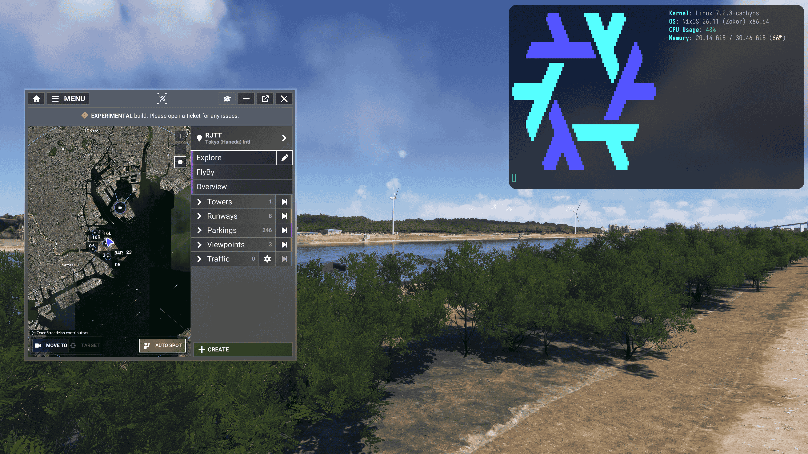

# ChasePlane (Parallel 42) on Proton - findings & fix

## What this is

ChasePlane, the camera addon, installs fine under Proton but does not work. The in-sim
control panel says it cannot connect to the bridge, and the camera never moves.

The reason is one missing Windows component. ChasePlane runs a helper program, the
bridge, that the panel talks to. That helper uses a part of .NET that needs Windows'
WebSocket support, which Linux and Wine do not provide, so the panel can ask but never
gets an answer. The part of ChasePlane that actually moves the camera never starts
either, so this is not a settings problem and no amount of tinkering inside the addon
fixes it.

`apply.sh` replaces one .NET file in the game's Wine prefix with the Linux version of
the same file, which answers the panel without that Windows component. Nothing in
ChasePlane itself is modified, so addon updates, sim updates and Steam updates do not
undo it. Using it means running one script and adding one Steam launch option.

_Note:_ This does not bypass any license checks. The installer, the bridge, the login
handshake and the CloudSync flow all run unmodified, and a genuine ChasePlane purchase
is still required. This is not piracy: the repo contains no Microsoft or Parallel 42
files. Everything the fix installs is downloaded from official sources when you run it,
under your own account and your own purchase.

## Proof

Proof that this fix actually works and isn't *just* AI slop.



## What you need

- Linux with Steam (Flatpak or regular) and MSFS 2024 installed and launched at least
  once. MSFS 2024's Steam app id is **2537590**. If unsure, run `protontricks` and pick
  the game from its list.
- ChasePlane installed the normal way. Its Windows installer runs fine under Proton;
  launch the sim once afterwards so the package lands in the `Community` folder.
- A terminal, and `bash`, `curl`, `python3`, `strings` and `pgrep`, which any normal
  Linux install already has.

- Confirmed working: ChasePlane bridge **2026.39.1.16** with the .NET 8 runtime
  **8.0.31**. `apply.sh` matches whatever .NET servicing release is already in the
  prefix and never modifies ChasePlane files, so a different bridge build is not
  expected to matter, but only the version above has been tested.

## Simple instructions

Close the sim first, then run this in a terminal in this folder:

```bash
# 1. Apply the fix. It downloads the Linux version of the file, prepares it,
#    swaps it, and keeps a copy of the original so you can undo.
./apply.sh 2537590

# 2. Steam -> MSFS 2024 -> Properties -> Installed -> Launch Options, then set:
#      DOTNET_ReadyToRun=0 %command%

# 3. Launch MSFS 2024 from Steam. ChasePlane works.
```

The launch option is part of the fix, not an optimisation. Without it the bridge crashes
before it ever opens its ports. You set it once and never think about it again.

`apply.sh` needs the real Microsoft .NET 8 runtime in the prefix. If it is missing it
installs it for you from Microsoft's own download servers. Do not run `winetricks
dotnet48` in an MSFS prefix: it removes Wine's built-in Mono. This fix does not use
Mono, but the effect on the sim is untested - and the .NET 8 runtime needed here is
what `apply.sh` installs.

## Did it work?

Open the ChasePlane panel in the sim. It should connect instead of reporting "can't
connect to bridge module", and the normal UI should load.

If you want to see it in the log, open
`AppData/Local/Programs/Parallel 42/ChasePlane/V2/MSFS2024/Logs/log.log` inside the
prefix and look for:

```
WS: Client (n) categorized as Private with name 'Toolbar'.
Helper: Cameras connected for generation 1: <n>
WS: Client (n) categorized as Private with name 'CP_DLL'.
```

The `CP_DLL` line is the important one. It only appears when the camera engine has been
loaded into the sim.

## If it does not work

- **Panel still cannot connect, and the log still shows `WebSocketProtocolComponent`.**
  The launch option is missing or mistyped, or the sim was already running when you
  applied the fix. Set `DOTNET_ReadyToRun=0 %command%` exactly, fully quit Steam so the
  option takes effect, and relaunch.
- **The log shows `AccessViolationException` and the bridge exits.** That is the missing
  launch option.
- **You are not sure what state the prefix is in.** Run `./apply.sh 2537590 --check`. It
  reports which version of the file is installed and whether it is loadable, and changes
  nothing.
- **`HTTP: Error starting listener: One or more errors occurred. (Invalid port in
  prefix.)`** Harmless. It is about port 8651, not the panel port, and the bridge falls
  back to a transport the panel already accepts. See *Gotchas*.
- **You want out.** `./apply.sh 2537590 --restore` puts the original file back, and
  removing the launch option returns the game to its starting state.

## When you need to run it again

Everything the fix changes lives in the game's prefix, so sim updates, ChasePlane updates,
bridge auto-updates and Steam or Proton updates all leave it in place. Re-run
`./apply.sh <appid>` only if:

- the prefix is wiped or recreated, or you reinstall MSFS 2024;
- the .NET runtime in the prefix is reinstalled or upgraded to a new version, since the
  swapped file is version-matched to it;
- a Proton or Wine update changes how .NET loads files and the swapped file stops
  loading. `--check` tells you whether that happened.

`apply.sh` is idempotent: if the fix is already applied it says so and does nothing. It
refuses to run while the ChasePlane bridge is still running, because the old file would
stay loaded in memory.

## Gotchas

- **Port 8651 always falls back to a raw transport.** The bridge asks for an address
  format that the Linux version of the file cannot parse, so it logs an error and uses
  its backup transport. The panel does not care. Nothing to fix.
- **Keep ChasePlane's LAN bindings on.** That is what makes the panel port bind in a way
  the Linux file understands. With LAN bindings off it uses the same address format that
  broke 8651, and the panel stops connecting again.
- **No encrypted connections.** The Linux version of the file cannot do TLS. ChasePlane
  uses plain local HTTP on both ports, so this never comes up.

## Deep dives

- `docs/internals.md` - the symptom chain, the exact Windows component that is missing,
  why the file swap needs a binary layout fix, why the launch option is needed, and the
  address-format bug.
- `docs/upstream.md` - what Parallel 42 and Wine could each change so none of this is
  needed.
